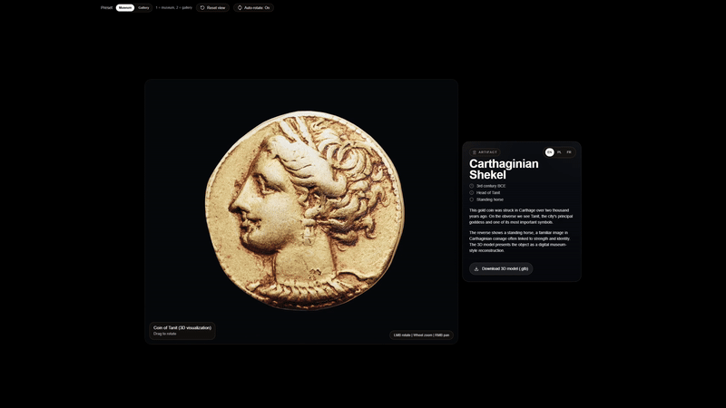
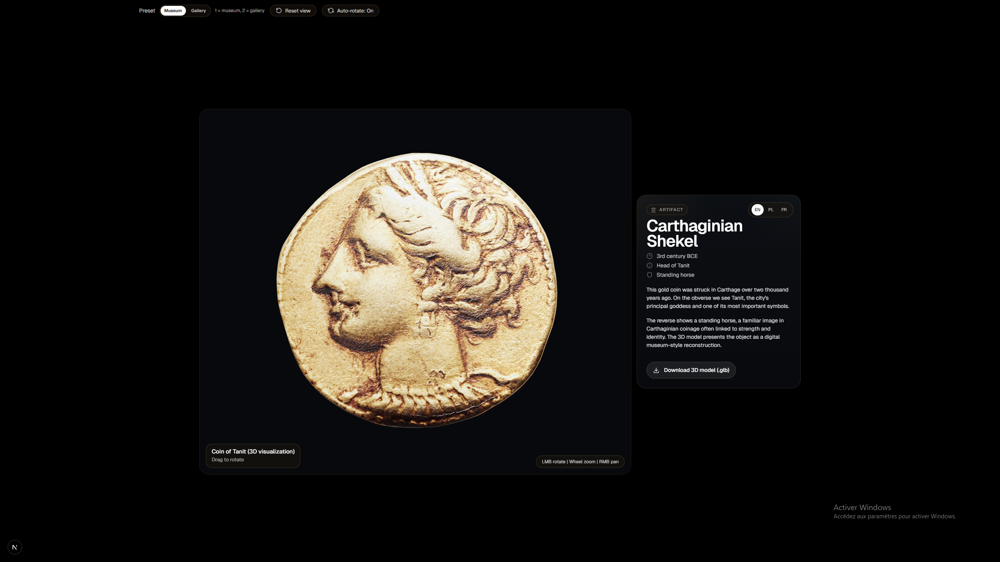
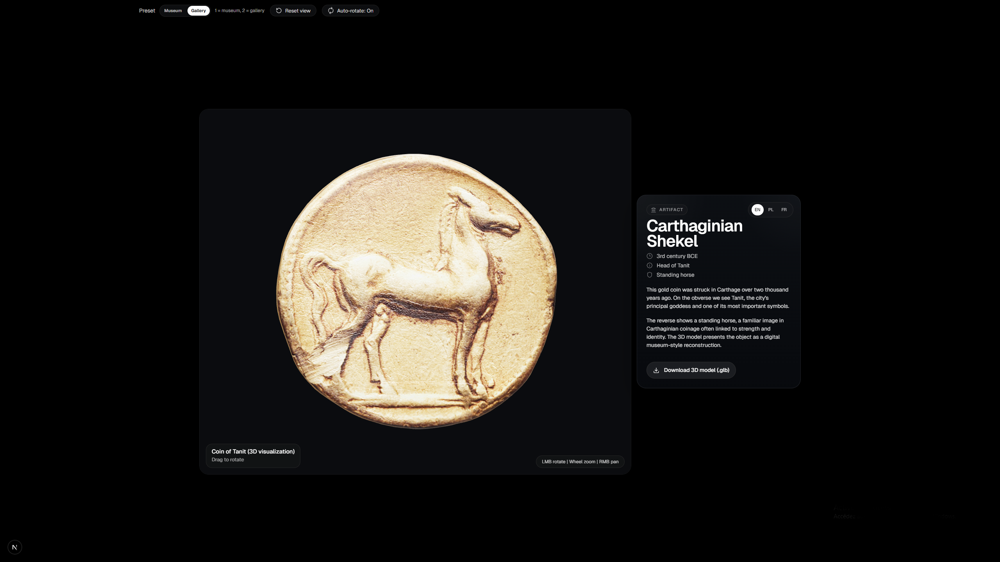
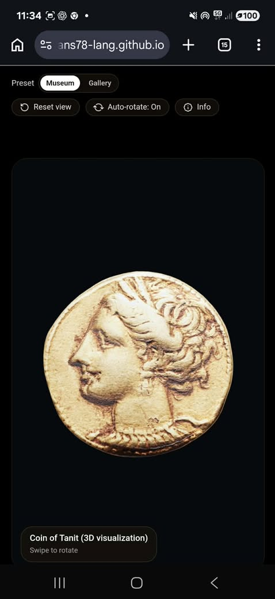

# 🪙 Carthaginian Shekel 3D Viewer

<p align="center">
  
</p>

<p align="center">
  
  
  
</p>

---

## ✨ Overview

Interactive **3D viewer of a Carthaginian Shekel coin** built with modern web technologies.

The project focuses on:
- realistic rendering
- immersive lighting presets
- smooth user interaction
- clean, modern UI inspired by digital museum experiences

---

## 🎬 Demo

<p align="center">
  
</p>

---

## 🎥 Full Video (Release)

👉 [Download / Watch full demo](./public/video/CarthaginianShekel3D.mp4)

---

## 🖼️ Screenshots

<p align="center">
  
  
</p>

<p align="center">
  
</p>

---

## 🚀 Features

- 🪙 High-quality **3D coin rendering (GLB)**
- 💡 **Lighting presets**
  - Museum mode
  - Gallery mode
- 🎮 Interactive controls (rotate / zoom)
- 📱 Responsive UI (desktop + mobile)
- ⚡ Optimized for performance (Next.js export)

---

## 🧠 Tech Stack

- **Next.js 13**
- **Three.js**
- **React**
- **GLTF / GLB models**
- **Custom lighting setup**

---

## 🛠️ Installation

```bash
npm install
npm run dev

Open:

http://localhost:3000