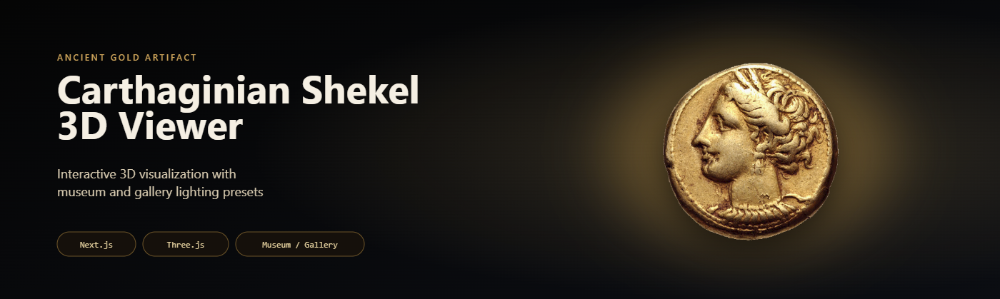

# 🏛️ Carthaginian Shekel 3D Viewer

🌐 **Live Demo:**  
https://nataliaans78-lang.github.io/Carthaginian-Shekel-3D-Viewer/

---

## ✨ Overview

Interactive 3D viewer of a Carthaginian Shekel coin built with modern web technologies.

- realistic rendering  
- lighting presets (museum / gallery)  
- smooth interaction  
- responsive UI  

---

## 🎬 Demo

---

## 🎥 Full Video

⬇️ Download demo (MP4):  
https://github.com/nataliaans78-lang/Carthaginian-Shekel-3D-Viewer/releases/download/v1.0/CarthaginianShekel3D.mp4  

📦 Release page:  
https://github.com/nataliaans78-lang/Carthaginian-Shekel-3D-Viewer/releases/tag/v1.0

---

## 🖼️ Screenshots

  
  

---

## 🚀 Features

- 3D coin rendering (GLB)  
- Museum / Gallery lighting  
- Rotate / zoom interaction  
- Mobile support  

---

## 🧠 Tech Stack

- Next.js  
- Three.js  
- React  

---

## 🛠️ Installation

npm install  
npm run dev  

Open:  
http://localhost:3000  

---

## 📚 Credits

Texture source:  
https://upload.wikimedia.org/wikipedia/commons/5/52/Carthage_EL_shekel_2250014.jpg  

---

## 📜 License

Educational & portfolio use.