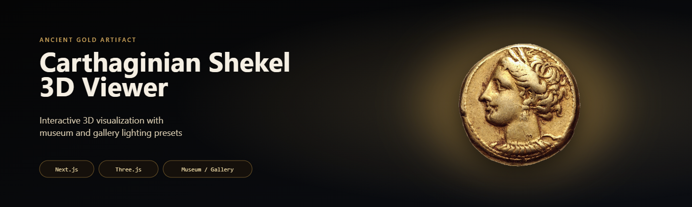
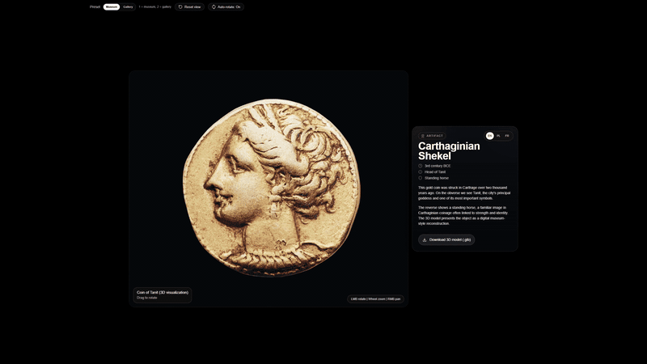
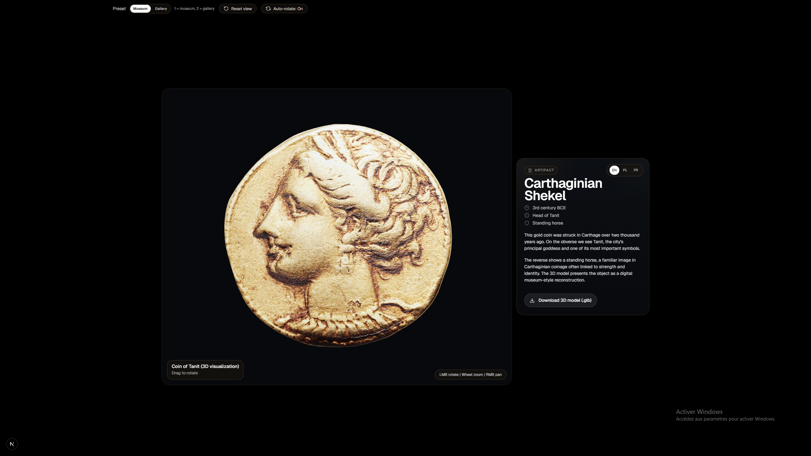
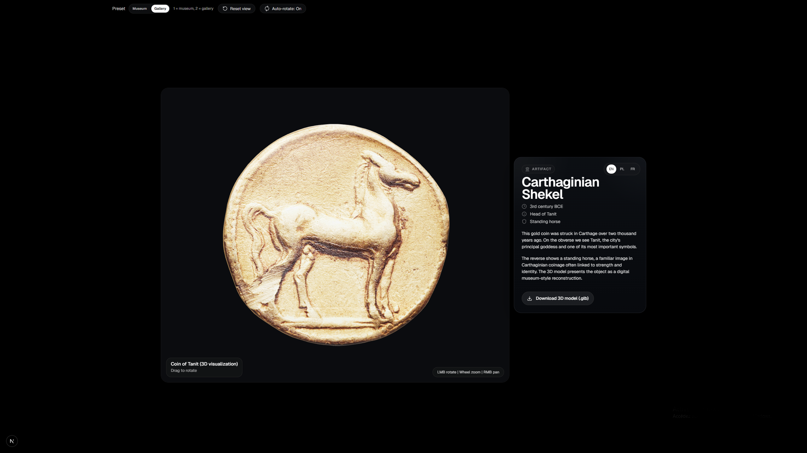
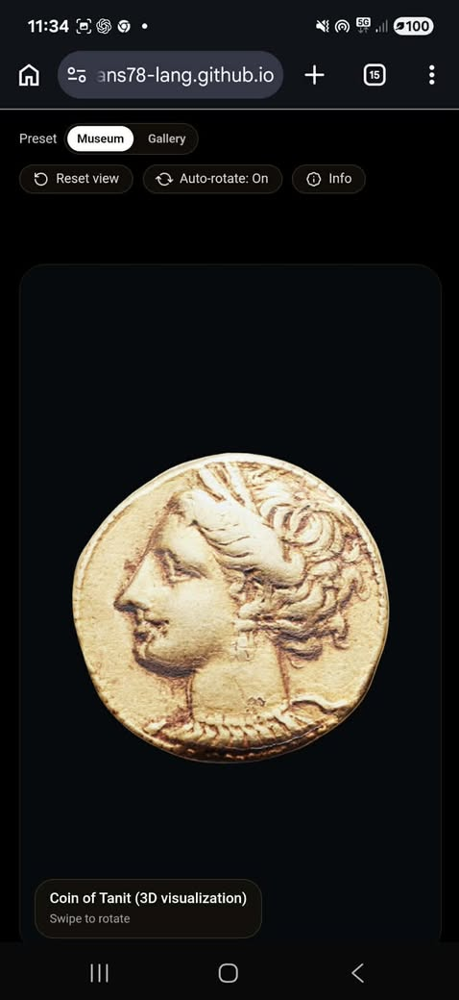

# Carthaginian Electrum Stater 3D Viewer



An interactive digital 3D visualization of a Carthaginian electrum stater, circa 310–290 BCE, depicting Tanit on the obverse and a standing horse on the reverse. It is based on the cited source image and is not an exact museum scan.

**Live demo:** https://nataliaans78-lang.github.io/Carthaginian-Shekel-3D-Viewer/

## Demo



## Video

- [Download the MP4 demo](https://github.com/nataliaans78-lang/Carthaginian-Shekel-3D-Viewer/releases/download/v1.0/CarthaginianShekel3D.mp4)
- [Open the v1.0 release](https://github.com/nataliaans78-lang/Carthaginian-Shekel-3D-Viewer/releases/tag/v1.0)

## Screenshots

<p align="center">
  
</p>

<p align="center">

</p>

## Features

- Interactive GLB rendering
- Museum and gallery lighting modes
- Rotate, zoom, and pan controls
- Keyboard shortcuts
- Responsive interface
- Mobile/tablet performance tuning
- Basic accessibility states for controls

## Controls

- Drag / LMB: rotate
- Mouse wheel: zoom
- RMB: pan
- 1 / 2: switch lighting mode
- R: reset view
- A: toggle auto-rotate

## Technology

- Next.js
- React
- Three.js

## Project notes

This project focuses on a compact interactive 3D exhibit experience:

- static export for GitHub Pages
- responsive 3D scene
- multilingual UI
- documented third-party asset licensing
- cleaned public assets and lighter deployment artifact

## Local development

```bash
npm ci
npm run dev
```

Open http://localhost:3000.

## Credits and asset licensing

The coin imagery used as source material is credited to Classical Numismatic Group, Inc. (CNG) and is available from Wikimedia Commons under the Creative Commons Attribution-ShareAlike 2.5 Generic license. The imagery was adapted for the textures and 3D visualization in this project.

See [ASSET-LICENSES.md](ASSET-LICENSES.md) for the exact source page, attribution, license terms, and notes about derivative assets.

## Source code license

No open-source license has been selected for this project's source code yet. The asset license described above does not automatically license the source code.
